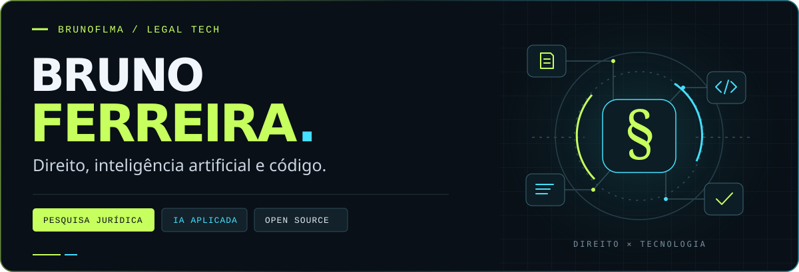

<picture>
  <source media="(max-width: 600px)" srcset="./assets/header-mobile.svg">
  
</picture>

 

## Tecnologia para o trabalho jurídico.

Sou **Bruno Ferreira**. Desenvolvo ferramentas que aproximam **Direito, inteligência artificial e software** — da pesquisa de jurisprudência à escrita jurídica e à organização do trabalho com assistentes de IA.

Meu foco está em transformar problemas do dia a dia em ferramentas úteis, com atenção às fontes, ao contexto e ao que o texto jurídico precisa preservar.

**[Legal tech ↓](#legal-tech-em-prática)** &nbsp; / &nbsp; **[Outras ferramentas ↓](#além-do-jurídico)** &nbsp; / &nbsp; **[Tecnologias ↓](#tecnologias-e-ecossistema)**

 

## Legal tech em prática

<a href="https://github.com/brunoflma/jurisprudenciaia-mcp">
  <picture>
    <source media="(max-width: 600px)" srcset="./assets/jurisprudenciaia-mobile.svg">
    
  </picture>
</a>

Conector MCP para usar o **JurisprudênciaIA no Claude, ChatGPT e Codex**, levando a pesquisa de jurisprudência para o fluxo de trabalho com assistentes de IA.

`Pesquisa jurídica` &nbsp; `MCP` &nbsp; `TypeScript`

**[Explorar o JurisprudênciaIA MCP ↗](https://github.com/brunoflma/jurisprudenciaia-mcp)**

 

<a href="https://github.com/brunoflma/jusmanizer">
  <picture>
    <source media="(max-width: 600px)" srcset="./assets/jusmanizer-mobile.svg">
    
  </picture>
</a>

Skill para revisar **petições, pareceres, contratos e outros textos jurídicos em português**, reduzindo os padrões de escrita de IA com instruções para preservar teses, fatos, pedidos e fontes.

`Escrita jurídica` &nbsp; `Agent skills` &nbsp; `Português`

**[Explorar o Jusmanizer ↗](https://github.com/brunoflma/jusmanizer)**

 

## Além do jurídico

Também construo ferramentas para tornar o trabalho com IA e documentos mais organizado.

| Projeto | O que resolve |
| :--- | :--- |
| **[Claude Session Linker](https://github.com/brunoflma/claude-session-linker)** | Visualização, vinculação e comparação de sessões do Claude Desktop entre contas no mesmo computador. |
| **[MD Studio](https://github.com/brunoflma/md-studio)** | Leitura e edição de Markdown no navegador, em um único arquivo HTML. |
| **[Context Guardian](https://github.com/brunoflma/context-guardian)** | Preservação de contexto e preparação da retomada de conversas longas com IA. |
| **[Context Status](https://github.com/brunoflma/context-status)** | Estimativas de uso de contexto e organização das decisões em conversas com IA. |

 

## Tecnologias e ecossistema

**Código** &nbsp; `TypeScript` · `Python` · `JavaScript` · `HTML / CSS`

**Integrações** &nbsp; `MCP` · `APIs` · `Cloudflare Workers`

**Ferramentas de IA** &nbsp; `Claude` · `ChatGPT` · `Codex` · `Agent skills`

 

---

**Direito como contexto. Código como ferramenta.**

[Veja meus repositórios ↗](https://github.com/brunoflma?tab=repositories) · Sugestões e contribuições são bem-vindas nas issues dos projetos.
