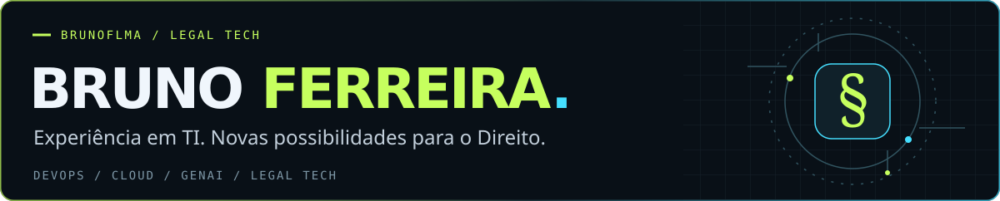
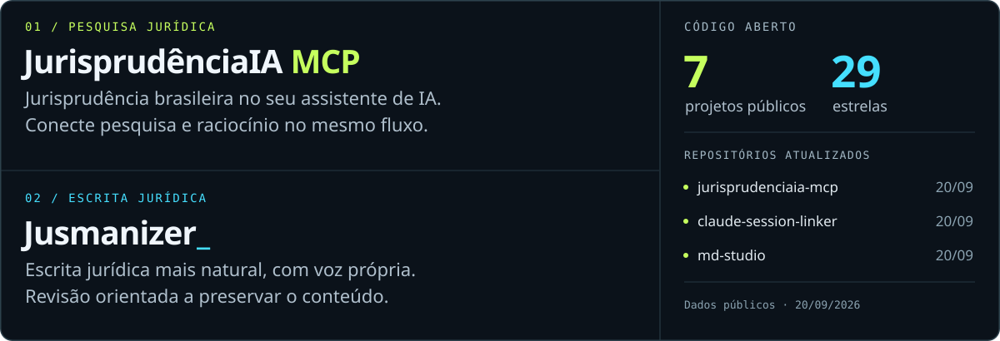

<picture>
  <source media="(max-width: 600px)" srcset="./assets/hero-mobile.svg">
  
</picture>

### Da infraestrutura à IA aplicada ao Direito.

Sou **Bruno Ferreira**, profissional de TI com **mais de 15 anos de experiência** em infraestrutura, sistemas, redes e segurança. 

Hoje direciono essa trajetória para **DevOps, Cloud e IA Generativa**, com foco crescente em soluções para o trabalho jurídico.

Minha atuação em **legal tech** parte de tarefas concretas: levar a pesquisa de jurisprudência para os assistentes de IA, aprimorar a revisão de textos jurídicos e organizar o trabalho com documentos. 

É nessa frente que desenvolvo o **JurisprudênciaIA MCP** e o **Jusmanizer**, além de ferramentas para dar continuidade ao trabalho com IA.

<picture>
  <source media="(max-width: 600px)" srcset="./assets/showcase-mobile.svg">
  
</picture>

**[JurisprudênciaIA MCP ↗](https://github.com/brunoflma/jurisprudenciaia-mcp)** &nbsp; · &nbsp; **[Jusmanizer ↗](https://github.com/brunoflma/jusmanizer)** &nbsp; · &nbsp; [Todos os projetos ↗](https://github.com/brunoflma?tab=repositories)

#### Tecnologias que conectam essas ideias

  
  
  
  
  
  

Integrações com **Claude, ChatGPT e Codex**, APIs e instruções reutilizáveis para assistentes de IA.

<strong>Por dentro dos projetos jurídicos</strong>

**[JurisprudênciaIA MCP](https://github.com/brunoflma/jurisprudenciaia-mcp)** — conector auto-hospedado em Cloudflare Workers que permite pesquisar jurisprudência brasileira com assistentes compatíveis com MCP. O projeto cuida da integração e do acesso; o serviço de pesquisa é o JurisprudênciaIA.

**[Jusmanizer](https://github.com/brunoflma/jusmanizer)** — skill de revisão de petições, pareceres, contratos e outros textos jurídicos em português. As instruções orientam a remover padrões artificiais de escrita e preservar argumentos, fatos, pedidos e fontes.

<strong>Outras ferramentas para trabalhar com IA e documentos</strong>

| Projeto | Para que serve |
| :--- | :--- |
| **[Claude Session Linker](https://github.com/brunoflma/claude-session-linker)** | Visualizar, vincular e comparar sessões do Claude Desktop entre contas no mesmo computador. |
| **[MD Studio](https://github.com/brunoflma/md-studio)** | Ler e editar Markdown no navegador, em um único arquivo HTML. |
| **[Context Guardian](https://github.com/brunoflma/context-guardian)** | Preservar decisões e preparar a retomada de conversas longas com IA. |
| **[Context Status](https://github.com/brunoflma/context-status)** | Estimar o uso de contexto e acompanhar decisões em conversas com IA. |

<strong>Trajetória, certificações e compartilhamento de conhecimento</strong>

Minha base profissional está na infraestrutura de TI: administração de sistemas, redes, servidores e segurança. 

A automação e a cultura DevOps conectam essa experiência ao trabalho atual com cloud e IA generativa.

Ao longo dessa trajetória, obtive certificações como **AWS Cloud Practitioner**, **Google Cloud Digital Leader**, **Azure Fundamentals**, **ITIL** e **Scrum Fundamentals**. Os detalhes estão no meu [LinkedIn](https://www.linkedin.com/in/brunoflma/).

Compartilhar conhecimento faz parte de como aprendo e trabalho.

**[Vamos conversar pelo LinkedIn ↗](https://www.linkedin.com/in/brunoflma/)** · Ideias, dúvidas e contribuições também são bem-vindas nas issues dos projetos.
